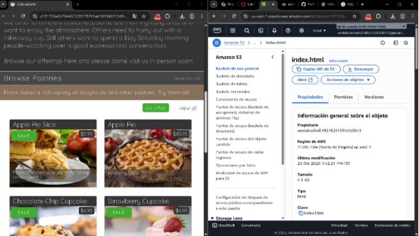
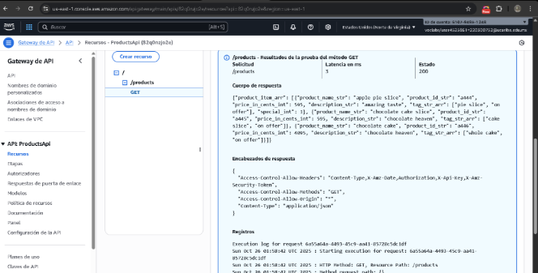
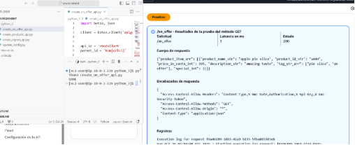
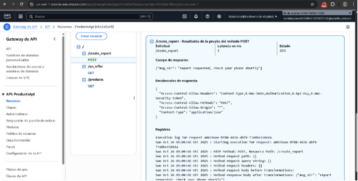
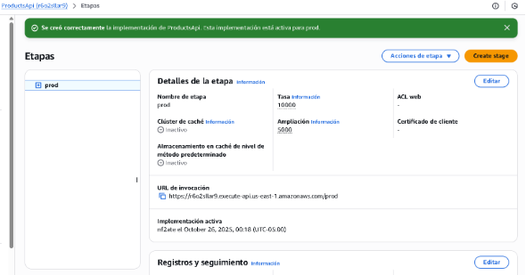
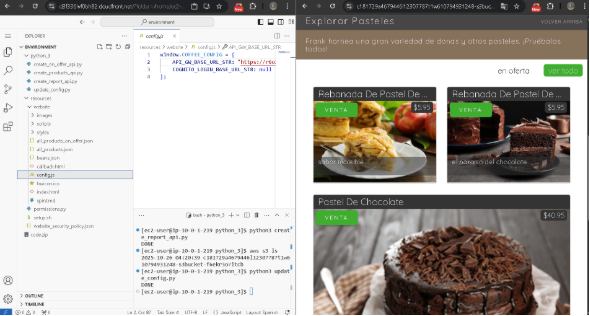

Lab 6.1: Developing REST APIs with API Gateway

En este laboratorio se desarrolló y desplegó una **API REST** utilizando **Amazon API Gateway**, integrándola con un **sitio web alojado en Amazon S3**.\
El objetivo principal fue crear endpoints funcionales que sirvan información sobre productos de una cafetería, y conectar estos endpoints con un sitio web ya existente, simulando un entorno real de servicios backend.

El proceso incluyó la configuración del entorno de desarrollo en **VS Code (code-server)**, la creación de recursos y métodos API, la ejecución de pruebas desde la consola de AWS y la actualización dinámica del sitio web para conectarlo con la API

🔹 Tarea 1: Preparar el Entorno de Desarrollo
### Conexión al IDE de VS Code
1. Desde la interfaz del laboratorio, se seleccionó:\
   **Details → AWS: Show**
1. Se copiaron los valores de LabIDEURL y LabIDEPassword.
1. Se abrió LabIDEURL en una nueva pestaña del navegador.
1. En la ventana **Welcome to code-server**, se ingresó la contraseña LabIDEPassword y se hizo clic en **Submit**.
### Descarga y extracción de archivos
wget https://aws-tc-largeobjects.s3.us-west-2.amazonaws.com/CUR-TF-200-ACCDEV-2-91558/04-lab-api/code.zip -P /home/ec2-user/environment

unzip code.zip
### Ejecución del script de configuración
chmod +x resources/setup.sh && resources/setup.sh

Durante la ejecución, se proporcionó la dirección IPv4 obtenida desde [whatismyip.com](https://www.whatismyip.com/).
### Verificación del entorno
aws --version       # Verifica versión 2 de AWS CLI

pip3 show boto3     # Verifica la instalación del SDK para Python
### Verificación del sitio web existente
1. En la **Consola de Amazon S3**, se accedió al bucket correspondiente.
1. Se copió la URL del objeto index.html:
1. https://<bucket-name>.s3.amazonaws.com/index.html
1. Se abrió la URL en el navegador para confirmar la correcta carga del sitio.

**🔹 Tarea 2: Creación del Primer Endpoint de API (GET)**
### Definición de la API de Productos
1. En el directorio python\_3/, se abrió el archivo create\_products\_api.py.
1. Se reemplazó (fill me in) por la creación del cliente de API Gateway:

client = boto3.client('apigateway')

3. Se guardó el archivo y se ejecutó el script:

cd python\_3

python3 create\_products\_api.py
### Prueba del endpoint
1. En la **Consola de API Gateway**, se seleccionó la API creada: **ProductsApi**.
1. Bajo el recurso /products, se eligió el método **GET**.
1. Se utilizó la opción **TEST** y se verificó la respuesta de prueba.

**🔹 Tarea 3: Creación del Segundo Endpoint de API (GET)**
### Definición del recurso /on\_offer
1. En el archivo create\_on\_offer\_api.py, se reemplazaron los marcadores:
   1. <FMI\_1> → api\_id
   1. <FMI\_2> → parent\_id
1. Se guardó y ejecutó el script:

python3 create\_on\_offer\_api.py
### Prueba del recurso
1. En **API Gateway**, se navegó a:\
   ProductsApi > /on\_offer > GET
1. Se seleccionó **TEST** y se ejecutó la prueba para validar la respuesta simulada.

**🔹 Tarea 4: Creación del Tercer Endpoint de API (POST)**
### Definición del recurso /create\_report
1. Se abrió el archivo create\_report\_api.py.
1. Se reemplazó <FMI\_1> con el ID de la API, obtenido mediante CLI:

aws apigateway get-rest-apis --query items[0].id --output text

3. Se ejecutó el script:

python3 create\_report\_api.py
### Prueba del endpoint POST
En la **Consola de API Gateway**, se validó el recurso:\
ProductsApi > /create\_report > POST\
para confirmar la correcta creación del método y la respuesta de prueba.

**🔹 Tarea 5: Despliegue de la API**

1. En la consola de **API Gateway**, se seleccionó la raíz / bajo el menú de **Recursos**.
1. Se hizo clic en **Acciones > Desplegar API**.
1. En el cuadro de diálogo, se eligió:
   1. **Etapa de despliegue:** Nueva Etapa
   1. **Nombre de la etapa:** prod
1. Se hizo clic en **Desplegar** y se copió la **URL de invocación** generada. 

## **🔹 Tarea 6: Actualización del Sitio Web**
### Modificación de la configuración local
1. En el archivo resources/website/config.js, se reemplazó:

const api\_url = "https://<api-id>.execute-api.us-east-1.amazonaws.com/prod";

2. Se guardó el archivo.
### Actualización del archivo en S3
1. Se editó el script update\_config.py reemplazando <FMI\_1> con el nombre del bucket (consultado con aws s3 ls).
1. Se ejecutó:

python3 update\_config.py
### Prueba final del sitio web
1. Se accedió nuevamente a la URL pública del sitio en S3.
1. Se verificó que las secciones de **productos** y **ofertas** obtuvieran datos desde la nueva API.

## **🔹 Conclusión**
En este laboratorio se logró implementar una **API REST completa** utilizando **AWS API Gateway** y **Python (boto3)**.\
Los principales logros fueron:

- Configuración del entorno en **VS Code** remoto proporcionado por AWS.
- Creación de endpoints **GET** y **POST** funcionales para un sitio web de café.
- Despliegue de la API con una etapa de producción (prod).
- Integración dinámica del sitio web con la API mediante la actualización del archivo config.js en S3.

Este ejercicio permitió comprender la arquitectura y flujo de trabajo entre **API Gateway**, **S3** y **boto3**, además de practicar la automatización de tareas con scripts Python y despliegues reales en la nube.
