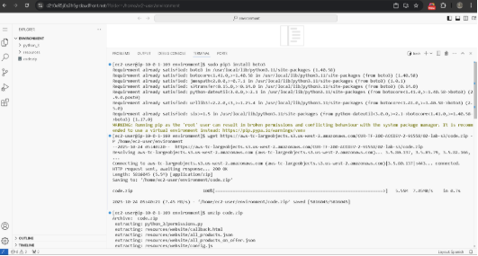
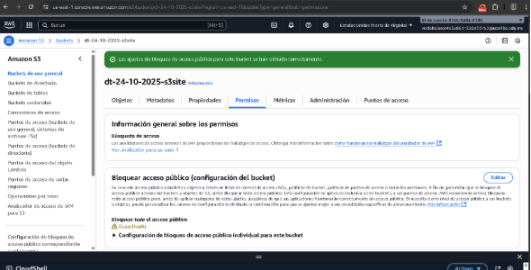
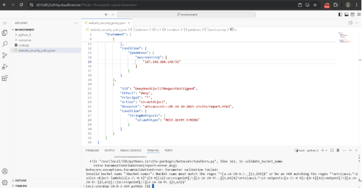
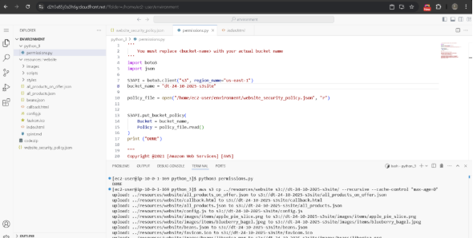
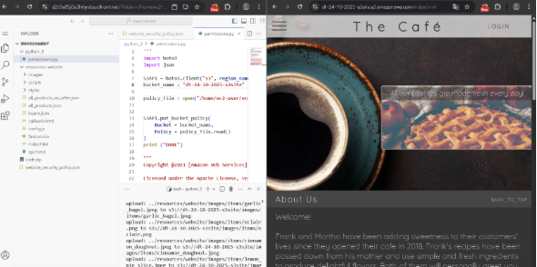
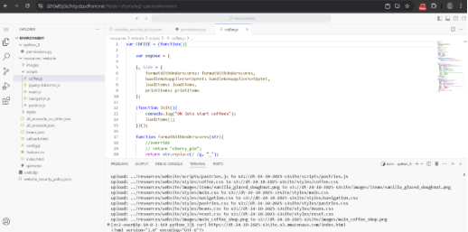

Laboratorio 3.1: Trabajar con Amazon S3

En este laboratorio se exploró el proceso completo para configurar un sitio web estático utilizando **Amazon S3** y el entorno de desarrollo **AWS Cloud9**.\
El objetivo fue comprender la interacción entre los servicios de AWS, desde la creación y configuración del bucket, hasta la implementación y prueba de un sitio web accesible públicamente.

**Tarea 1: Acceso a la Consola de Administración de AWS y Configuración del Entorno**
### Pasos Realizados
1. Se inició el laboratorio desde la plataforma de AWS Academy.
1. Se esperó hasta que el estado del laboratorio mostrara **“listo”**, y luego se cerró el panel de inicio.
1. Se accedió a la **Consola de Administración de AWS** haciendo clic en el enlace “AWS”.
### Instalación del AWS SDK para Python
En la terminal Bash, se ejecutó:

sudo pip install boto3
### **Descarga y extracción de archivos del laboratorio**
wget https://aws-tc-largeobjects.s3.us-west-2.amazonaws.com/CUR-TF-200-ACCDEV-2-91558/02-lab-s3/code.zip -P /home/ec2-user/environment

unzip code.zip
### Verificación de la versión de AWS CLI
aws --version
## 🔹 Tarea 2: Creación de un Bucket de S3 Usando AWS CLI
### Creación del Bucket
aws s3api create-bucket --bucket dt-2025-10-24-s3site --region us-east-1
### Verificación del Bucket
- Se accedió a **Servicios → S3**.
- Se confirmó la creación del bucket dt-2025-10-24-s3site.
### Configuración de Permisos
1. En la pestaña **Permisos**, se hizo clic en **Editar** bajo “Bloquear acceso público”.
1. Se desmarcaron todas las opciones excepto:
   1. *Bloquear el acceso público a buckets y objetos otorgado a través de nuevas ACLs.*
   1. *Bloquear el acceso público a buckets y objetos otorgado a través de cualquier ACL.*
   1. *Bloquear el acceso público y entre cuentas a buckets y objetos a través de políticas de bucket o punto de acceso público.*
1. Se guardaron los cambios y se confirmó escribiendo confirm.

## 🔹 Tarea 3: Configuración de una Política de Bucket Usando el SDK para Python
### Creación del Documento de Política
Archivo: website\_security\_policy.json\
Se reemplazaron los valores <bucket-name> y <ip-address> por los correspondientes.
### Aplicación de la Política Usando Python
cd python\_3

python3 permissions.py

Este script aplica la política de seguridad al bucket mediante **boto3**, restringiendo el acceso al sitio web únicamente desde la dirección IP pública configurada.

## 🔹 Tarea 4: Carga de Objetos al Bucket para Crear un Sitio Web
Se cargaron los archivos del sitio web mediante el siguiente comando:

aws s3 cp ../resources/website s3://dt-2025-10-24-s3site/ --recursive --cache-control "max-age=0"

Esto permitió que los archivos HTML, CSS, JS y JSON del sitio quedaran disponibles en el bucket.

## 🔹 Tarea 5: Prueba de Acceso al Sitio Web
### Verificación del Sitio
1. En la **Consola de S3**, se abrió el bucket y se seleccionó index.html.
1. Se copió la URL del objeto:

https://dt-2025-10-24-s3site.s3.amazonaws.com/index.html
### Prueba Externa
Se probó el acceso desde la terminal usando curl:

curl https://dt-2025-10-24-s3site.s3.amazonaws.com/index.html

El comando devolvió el contenido HTML esperado del sitio web.

## 🔹 Tarea 6: Análisis del Código del Sitio Web
### Archivos Revisados
- **index.html:** Página principal con estructura básica del sitio y referencias a los scripts.
- **config.js:** Contiene parámetros de configuración del sitio web, como rutas y ajustes de visualización.
- **pastries.js:** Define funciones para mostrar los productos y categorías en la interfaz.
- **all\_products.json:** Archivo con los datos de los productos, nombres, precios y descripciones.

El análisis de estos archivos permitió comprender cómo se genera dinámicamente el contenido del sitio a partir de los datos JSON.

## 🔹 Conclusión
El laboratorio permitió comprender de manera práctica el proceso de despliegue de un **sitio web estático en Amazon S3**, desde la creación del bucket hasta la aplicación de políticas de seguridad y la carga de archivos.\
Se reforzó el uso de la **AWS CLI** y del **SDK de Python (boto3)** para automatizar tareas de configuración, además de validar el funcionamiento de la infraestructura en la nube mediante pruebas de acceso público.

