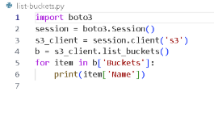
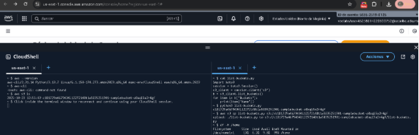
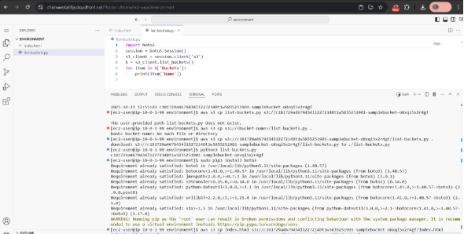
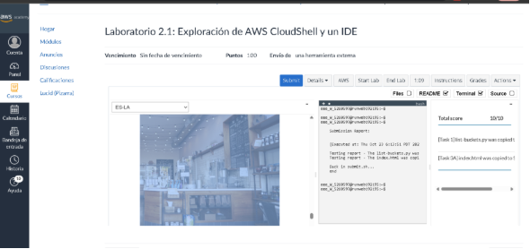

**Lab 2.1: Explorando AWS CloudShell y un IDE**

**Objetivo**

Familiarizarse con **AWS CloudShell** como entorno de desarrollo, verificar herramientas como **AWS CLI** y el **SDK para Python (Boto3)**, y practicar comandos básicos para interactuar con **Amazon S3**.\
Además, aprender a usar el **IDE de VS Code en AWS** para crear, ejecutar y administrar archivos en la nube.

**Parte 1: Acceso a la consola de AWS Academy**

1. Haz clic en **Start Lab** en la parte superior de la página.
1. Espera hasta que aparezca el mensaje **Lab status: ready**.
1. Cierra el panel de inicio haciendo clic en la **X**.
1. Haz clic en el botón **AWS** para abrir la consola de administración.

**Parte 2: Uso de AWS CloudShell**

1. En la consola de AWS, haz clic en el ícono de **CloudShell** (esquina superior derecha).
1. Si aparece la ventana emergente de bienvenida, selecciona **Close**.
1. Verifica que **AWS CLI** esté instalado: \
   aws –versión\
   Debes ver algo similar a:\
   aws-cli/2.x.x
1. Prueba el acceso a S3:\
   aws s3 ls\
   Deberías ver la lista de buckets disponibles.
1. Divide la terminal en columnas:\
   **Actions > Tabs layout > Split into columns**
1. Prueba el SDK de Python:\
   Crea un archivo llamado list-buckets.py con este contenido:
   1. Sube el archivo a CloudShell:
      1. Ve a **Actions > Files > Upload file**
      1. Selecciona list-buckets.py y haz clic en **Upload**
   1. Ejecuta los siguientes comandos:
      1. cat list-buckets.py → muestra el contenido
      1. python3 list-buckets.py → ejecuta el script
      1. Verifica que se impriman los nombres de los buckets
1. Copia el archivo al bucket S3:
   1. Identifica el bucket que contiene -sample-bucket-
   1. Ejecuta: aws s3 cp list-buckets.py s3://<nombre-del-bucket>
1. Verifica el almacenamiento de CloudShell:
   1. Ejecuta: df -H /home

` `**Parte 3: Probar el SDK de Python (Boto3)**

1. Crea un archivo llamado list-buckets.py con el siguiente contenido:
1. import boto3

1. s3 = boto3.client('s3')
1. response = s3.list\_buckets()

1. print("Buckets disponibles:")
1. for bucket in response['Buckets']:
1. `    `print(f"- {bucket['Name']}")
1. Sube el archivo a CloudShell:\
   **Actions > Files > Upload file > Selecciona list-buckets.py > Upload**
1. Ejecuta los comandos:
1. cat list-buckets.py     # muestra el contenido del archivo
1. python3 list-buckets.py # ejecuta el script

   Debes ver los nombres de los buckets S3 listados.

1. Copia el archivo al bucket S3:
1. aws s3 cp list-buckets.py s3://<nombre-del-bucket>
1. Verifica el almacenamiento disponible en CloudShell:
1. df -H /home

**Parte 4: Uso del IDE de VS Code en AWS**

1. En la parte superior de las instrucciones, selecciona **Details > AWS: Show**.
1. Copia los valores de **LabIDEURL** y **LabIDEPassword**.
1. Abre una nueva pestaña del navegador y pega **LabIDEURL**.
1. Introduce la contraseña **LabIDEPassword** y haz clic en **Submit**.
1. Explora el entorno gráfico del **IDE de VS Code**:
   1. Panel izquierdo: sistema de archivos
   1. Parte inferior: terminal Bash
   1. Parte central: editor de código

**Parte 5: Descargar, ejecutar e instalar dependencias**

1. Descarga el archivo Python desde S3 al IDE:
1. aws s3 cp s3://<nombre-del-bucket>/list-buckets.py .
1. Abre list-buckets.py en el editor.
1. Ejecuta el script:
1. python3 list-buckets.py

   Si aparece el error **ModuleNotFoundError: No module named 'boto3'**, instala la librería:

   sudo pip3 install boto3

1. Ejecuta nuevamente:
1. python3 list-buckets.py

   ✅ Ahora debe mostrar el nombre del bucket S3.

**Parte 6: Crear y subir un archivo HTML a S3**

1. Crea un nuevo archivo HTML:
   1. Ve a **File > New Text File**
   1. Escribe:
   1. <body>Hello World</body>
   1. Guarda el archivo como index.html
1. Sube el archivo HTML al bucket S3:
1. aws s3 cp index.html s3://<nombre-del-bucket>
1. Deberías ver un mensaje como:

   upload: ./index.html to s3://<bucket>/index.html

   

